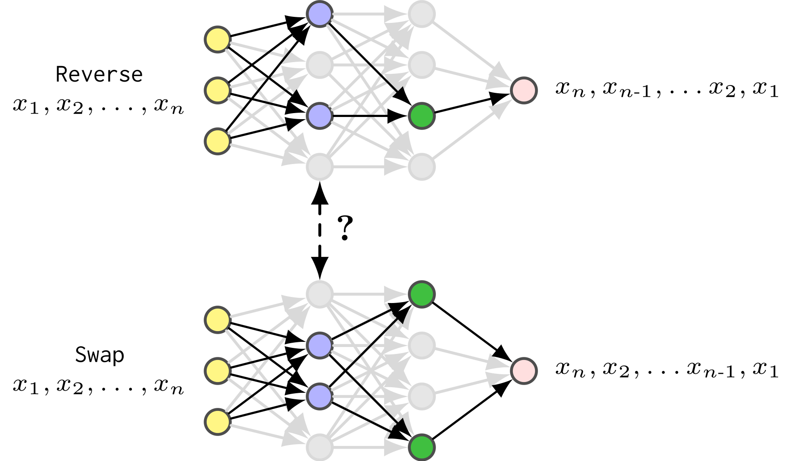

<h1 align="center">Circuit Compositions: Exploring Modular Structures in Transformer-Based Language Models</h1>

<p align="center">
    <a href="LICENSE">  </a>
</p>

<div style="text-align: center; width: 100%;">
  <!-- Container to align the image and the caption -->
  <div style="display: inline-block; text-align: left; width: 80%;">
    
  </div>
</div>

<br>

A fundamental question in interpretability research is to what extent neural networks, particularly language models, implement reusable functions via subnetworks that can be composed to perform more complex tasks. Recent developments in mechanistic interpretability have made progress in identifying subnetworks, often referred to as circuits, which represent the minimal computational subgraph responsible for a model's behavior on specific tasks. However, most studies focus on identifying circuits for individual tasks without investigating how functionally similar circuits relate to each other. To address this gap, we examine the modularity of neural networks by analyzing circuits for highly compositional subtasks within a transformer-based language model. Specifically, given a probabilistic context-free grammar, we identify and compare circuits responsible for ten modular string-edit operations. Our results indicate that functionally similar circuits exhibit both notable node overlap and cross-task faithfulness. Moreover, we demonstrate that the circuits identified can be reused and combined through subnetwork set operations to represent more complex functional capabilities of the model.


## Directories
- [Code](code)
- [Data](data)

# Reproducibility
The following sections outline how our results can be reproduced. We provide general scripts that illustrate the pipeline using mean ablation.

## Step 0: Environment setup
All code was developed and tested on Ubuntu 22.04 with Python 3.12.0. 

To run the current code, we recommend to use Poetry:
```
cd code
poetry install                          # Install dependencies
poetry shell                            # Activate virtual environment
# Work for a while
deactivate
```

## Step 1: Generating the data

The core PCFG data can be downloaded and transformed to a common format by running the script:

```./data/download_and_transform_base_data.sh```

The isolated function can be created by running:

```./data/generate_function_splits.sh```

Running these two scripts will result in a ```./data``` directiory that has both the data needed for training the base model and the 10 isolated function datasets used for training masks.

## Step 2: Training a base model
In order to easily train a base model, we provide an example script in:

```./code/example_runs/train_base_model.sh```

Running this will create the folder ```./model_checkpoints``` with the subfolder ```pcfgs_base``` which contains the pytorch checkpoint and a tokenizer. If you want to use wandb for logging, you have to add your project identifier to ```./code/train.py``` and set the ```mode``` attribute of the logger to enabled.


## Step 3: Calculating the mean values
The next step is to calculate the mean values of the base model on the ten individual function tasks. This can be done by running the script: 

```./code/example_runs/calculate_mean_values.sh```

This creates the folder ```../comp_rep/pruning/mean_ablation_values``` with one ```.json``` for each task that contains the mean activation value of the base model on that task for each of the mediators.

## Step 4: Caching the probabilities of the base model
Our model relies on two forward passes during mask training. In order to reduce the runtime of the mask training, we cache the probabilities of the base model on all samples from the function dataset. This can be done by running:

```./code/example_runs/cache_probabilities.sh```

This creates the folder ```./data/cached_probabilities/``` which contains a subfolder for each subtask. These subfolders contains the cached probabilities for both the train and test sets for that task, stored in ```.pt``` format. 

## Step 5: Training masks
The next step is to train masks. We provide an example script for training mean ablation circuits in:

```./code/example_runs/train_mask_model.sh```

Running this will train 10 masks, one for each circuit. In our paper we use different hyperparameters for different subtasks. This needs to be adjusted for in the abovementioned script. Hyperparameters can be found in the paper in appendix B. On an AMD Instinct MI250X, mask training takes approximately two hours per mask. As with step 2, if you want to use wandb for logging, please make the same changes to ```./code/mask_train.py```.

## Step 6: Tracr experiments
In `./tracr_models` and `./data/tracr_data` we provide pre-compiled
models and data for the Tracr experiments reported in the paper. To
reproduce the results and see the resulting circuits, run:

```
python ./code/tracr_validation/train_tracr_mask.py 
    --model_path ../tracr_models/echo/tracr_model_echo.pkl 
    --data_path ../data/tracr_data/echo
    --subtask echo
    --train_batch_size 8
    --epochs 200
    --mask_lambda 1e-4
    --max_temp 200
    --mask_initial_value 1.0
    --lr 1e-3
    --eval
```

## Step 7: Evaluation
In ```./code/circuit_evaluations``` we provide a range of evaluation scripts that reproduce the experiments from the paper.

### Performance evaluation
To calculate the performance (accuracy, JSD faithufulness, KL divergence) between the circuits and the different subtasks, run:

```
python ./code/circuit_evaluations/calculate_performance_evaluation.py
  --cache_dir="./data/cached_probabilities/"
  --model_dir="./model_checkpoints"
  --result_dir="./results
  --ablation_value="mean"
  --mask_func_equivalence  # Setting this toggles only evaluating different token positions
```

### Overlap evaluation
To calculate the IoU and IoM overlap, you can run:
```
python ./code/circuit_evaluations/circuit_overplap_evaluation.py
  --model_path="./model_checkpoints"
  --result_dir="./restuls/
  --ablation_value="mean"
```


## License

This work is licensed under a [CC BY-SA 4.0](https://creativecommons.org/licenses/by-sa/4.0/).

## Citation
If you find our work helpful, you can cite this paper as:
```
@inproceedings{mondorf-etal-2025-circuit,
title = "Circuit Compositions: Exploring Modular Structures in Transformer-Based Language Models",
author = "Mondorf, Philipp  and Wold, Sondre  and Plank, Barbara",
editor = "Che, Wanxiang  and Nabende, Joyce  and Shutova, Ekaterina  and Pilehvar, Mohammad Taher",
booktitle = "Proceedings of the 63rd Annual Meeting of the Association for Computational Linguistics (Volume 1: Long Papers)",
month = jul,
year = "2025",
address = "Vienna, Austria",
publisher = "Association for Computational Linguistics",
url = "https://aclanthology.org/2025.acl-long.727/",
doi = "10.18653/v1/2025.acl-long.727",
pages = "14934--14955",
ISBN = "979-8-89176-251-0",
}
```
